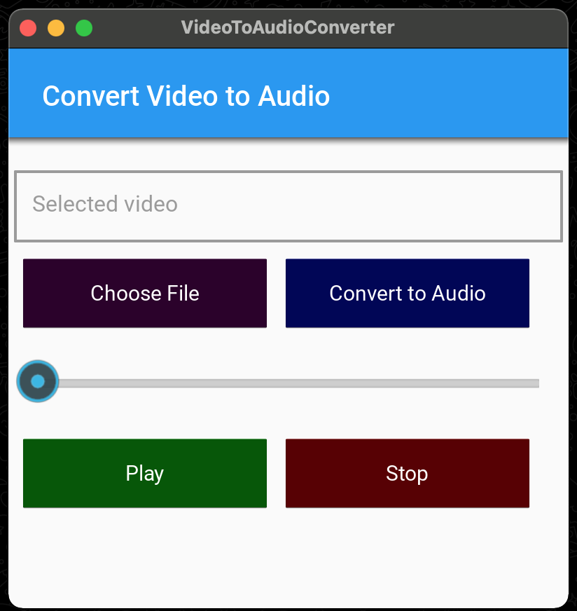

# converting_video_to_audio
# Video to Audio Converter

Convert video files to audio with ease using this simple Kivy-based application.

## Table of Contents

- [Overview](#overview)
- [Features](#features)
- [Getting Started](#getting-started)
- [Usage](#usage)
- [Dependencies](#dependencies)
- [Contributing](#contributing)
- [License](#license)

## Overview

This project provides a user-friendly interface for converting video files (specifically in the *.mp4 format) to audio files. It utilizes the Kivy framework for the graphical user interface and the MoviePy library for video processing.

## Features

- Choose a video file using the "Choose File" button.
- Convert the selected video to audio using the "Convert to Audio" button.
- Play the converted audio with play, stop, and seek functionality.
- Real-time feedback on the conversion process.

## Getting Started

Follow these steps to get the project up and running on your local machine:

1. Clone the repository:

    ```bash
    git clone https://github.com/your-username/your-repository.git
    cd your-repository
    ```

2. Install the required dependencies:

    ```bash
    pip install -r requirements.txt
    ```

3. Run the application:

    ```bash
    python main.py
    ```

## Usage

1. Launch the application.
2. Click the "Choose File" button to select a video file (*.mp4).
3. Click the "Convert to Audio" button to initiate the conversion process.
4. Use the play, stop, and seek buttons to control audio playback.

## Dependencies

- Kivy: [link](https://kivy.org/)
- MoviePy: [link](https://zulko.github.io/moviepy/)

## Contributing

Contributions are welcome! Follow these steps to contribute:

1. Fork the repository.
2. Create a new branch (`git checkout -b feature/your-feature`).
3. Make your changes.
4. Commit your changes (`git commit -am 'Add new feature'`).
5. Push to the branch (`git push origin feature/your-feature`).
6. Create a new pull request.

## LEATICIA

This project is licensed under the [MIT License](LICENSE).

